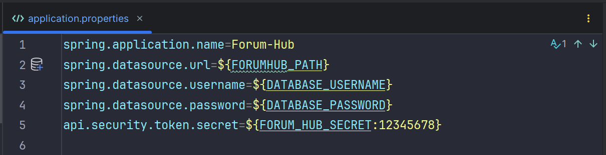

<h1>Forum Hub API</h1>

A aplicação simula uma API de um Forúm, onde pessoas podem cadastrar respostas para os tópicos, tópicos para os cursos e cursos. Antes é necessário a criação de um usuário e a autênticação.

Este projeto foi desenvolvido em Java com Spring framework e utiliza um banco de dados relacional (MySQL/Postgres) para a persistência de dados. 

<h2>Motivação</h2>
    
O Fórum Hub API é o desafio final do programa Oracle Next Education da Alura em parceria com a Oracle, e que tive o privilégio de participar como bolsista, e a disciplina de concluir, buscando absorver o máximo de conhecimento possível.

<h2>Como utilizar</h2>
<ul style="text-align: justify">
    <li>Este projeto utiliza o Java na versão <strong>21</strong>;</li>
    <li>O arquivo "application.properties" requer a configuração de variáveis de ambiente com chaves que tenham a mesma nomeclatura definida nele, e os valores personalizados de acordo com a sua necessidade.</li>
    
    <li>Após a instalação das dependências requeridas, é possível executá-lo;</li>
    <li>Por padrão, a aplicação é executada na port 8080.</li>
    <li>É possível verificar a documentação da API através do caminho: <strong>http://host:port/swagger-ui.html</strong></li>
</ul>
<h2>Primeiro uso</h2>
<ul style="text-align: justify">
<li>Através da rota /registrar, é necessário criar uma requisição com método POST e com um corpo que contenha uma chave "email" e outra "senha", e com seus respectivos valores, para a criação de usuário.</li>
<li>Em seguida, deve ser feito a autenticação do usuário através da rota /login, do tipo POST, utilizando as mesmas chaves utilizadas durante a criação. Em seguida, é retornado um token válido por 2 horas, que permitirá o acesso das demais funcionalidades. Para melhor esclarecimento, consultar a documentação na URI: <strong>http://host:port/swagger-ui.html</strong></li>
</ul>

